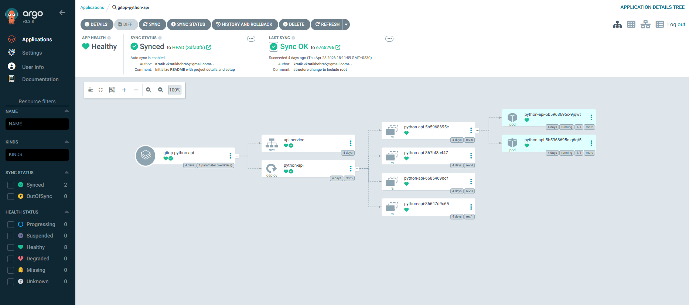
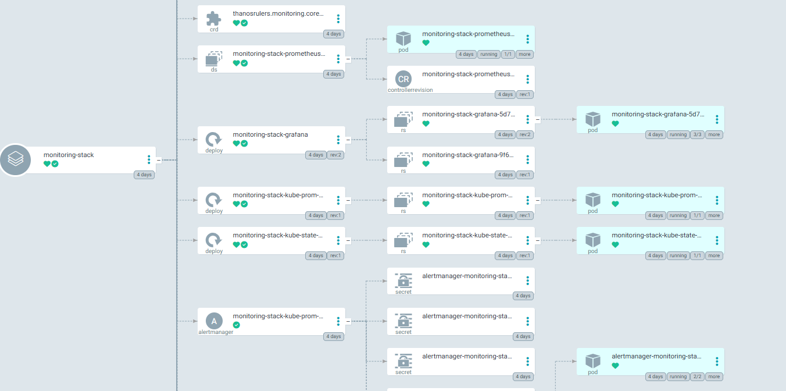
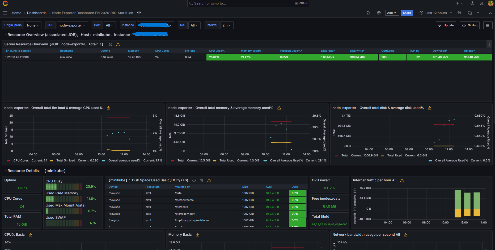

# 🚀 GitOps-Driven Observable Python Web Cluster

A production-ready, cloud-native web cluster designed with a **GitOps-first** philosophy. This project demonstrates the automation of a Python (FastAPI) microservice stack with automated CI/CD, self-healing infrastructure, and real-time observability.

## 🏗️ System Architecture
The system follows a modern DevOps lifecycle:
1.  **Code:** FastAPI (Python 3.12) with Prometheus instrumentation.
2.  **CI (GitHub Actions):** Automated linting, multi-stage Docker builds, and pushing to Docker Hub with Git SHA tagging.
3.  **CD (ArgoCD):** GitOps controller monitoring the `k8s/` manifest directory for automated reconciliation.

4.  **Orchestration:** Kubernetes (Minikube) managing high-availability deployments and persistent storage for PostgreSQL.
5.  **Observability:** Kube-Prometheus-Stack (Prometheus & Grafana) for real-time metrics scraping and visualization.


---

## 🛠️ Tech Stack
| Category | Tools |
| :--- | :--- |
| **Language/Framework** | Python 3.12, FastAPI, SQLAlchemy |
| **Containerization** | Docker (Multi-stage builds) |
| **Orchestration** | Kubernetes (Minikube) |
| **CI/CD** | GitHub Actions, ArgoCD (GitOps) |
| **Database** | PostgreSQL 16 (StatefulSet/Persistent Volumes) |
| **Observability** | Prometheus, Grafana, ServiceMonitors |

---

## 🚀 Getting Started

### Prerequisites
* [Minikube](https://minikube.sigs.k8s.io/docs/start/) installed with the Docker driver.
* [kubectl](https://kubernetes.io/docs/tasks/tools/) CLI.
* A Docker Hub account.

### 1. Local Development
To run the application and database locally for testing:
```powershell
docker-compose up --build
```
Access the API at `http://localhost:8000`.

### 2. Infrastructure Deployment (GitOps)
1.  **Install ArgoCD:**
    ```powershell
    kubectl create namespace argocd
    kubectl apply -n argocd -f https://raw.githubusercontent.com/argoproj/argo-cd/stable/manifests/install.yaml
    ```
2.  **Deploy the Monitoring Stack:**
    Apply the bootstrap manifest to install Prometheus and Grafana via ArgoCD:
    ```powershell
    kubectl apply -f bootstrap-monitoring.yaml -n argocd
    ```
3.  **Connect the Application:**
    Create a new App in ArgoCD pointing to the `/k8s` directory of this repository.

---

## 📊 Observability & Monitoring
This project implements **Deep Observability** through:
* **Custom Metrics:** The Python API exposes a `/metrics` endpoint using `prometheus-fastapi-instrumentator`.
* **Service Discovery:** A Kubernetes `ServiceMonitor` allows Prometheus to dynamically discover and scrape the API.
* **Visualization:** Grafana dashboards (ID: 11074) provide real-time insights into request rates, latency, and pod resource consumption.

---

## 🛡️ Security & Best Practices (Technical GRC)
* **Image Security:** Utilizes `python:3.12-slim` as a base to minimize the attack surface.
* **Secret Management:** Database credentials and Grafana admin passwords are managed via Kubernetes Secrets, decoupled from the source code.
* **Resource Limits:** Kubernetes deployments define CPU and Memory requests/limits to prevent noisy neighbor issues and OOM kills.
* **GitOps Audit Trail:** Every infrastructure change is recorded in Git, providing a clear audit log for compliance.

---

## 🛤️ Roadmap
- [x] Build CI/CD Pipeline with GitHub Actions
- [x] Implement GitOps with ArgoCD
- [x] Deploy Prometheus/Grafana Monitoring Stack
- [ ] **Phase 2:** Integrate DevSecOps (Trivy, Gitleaks, Checkov)

---

